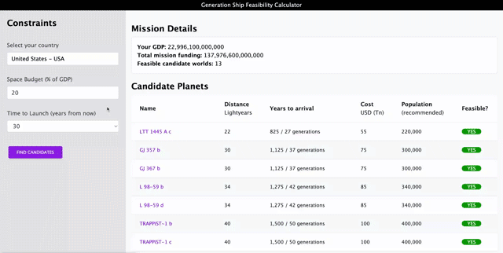
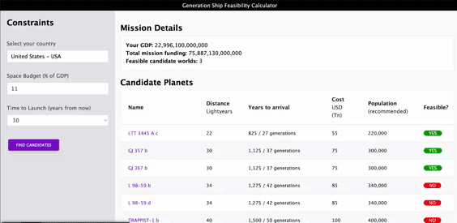
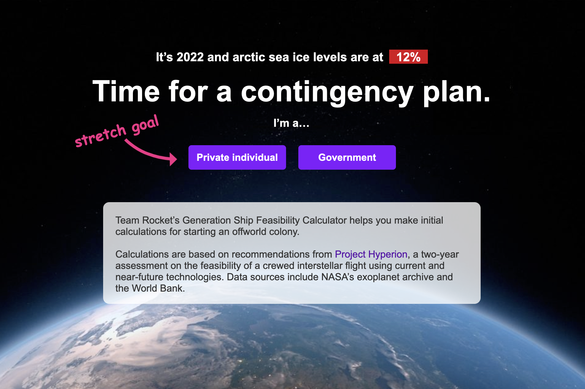
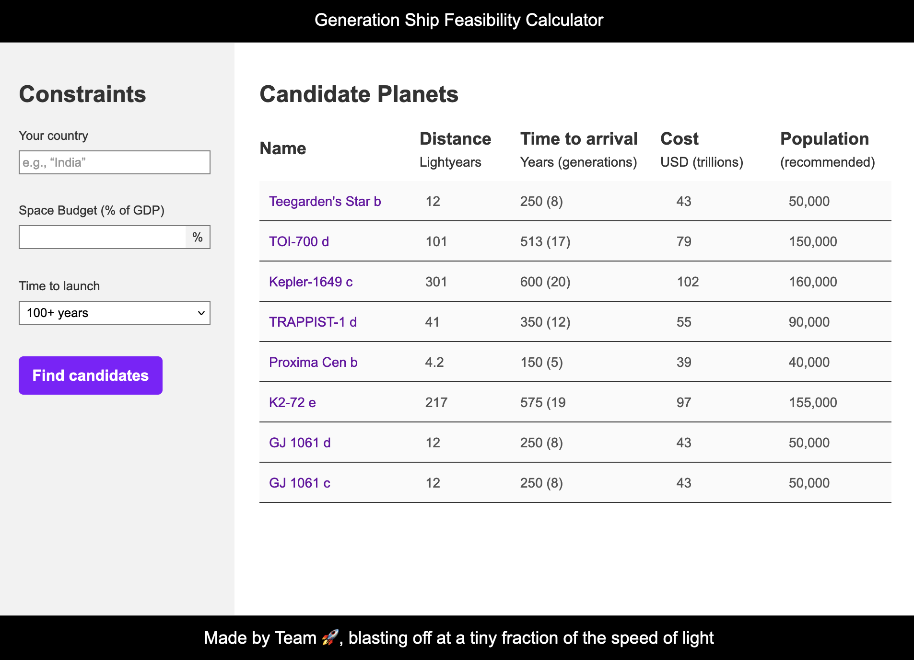

# Interstellar Generation Ship Feasibility Calculator

## Check out the [deployed app](https://lshillman.github.io/generation-ship-calculator/)

This is a calculator that you, a government representative can use to determine whether an offworld colony ship is feasible, given your GDP and space program budget.

Or that you, a wealthy private individual with disproportionate access to planetary resources, can use to determine whether you could fund such an endeavor out of your personal coffers.

This is ~~based on~~ _inspired by_ work by [Project Hyperion](https://en.wikipedia.org/wiki/Project_Hyperion_(interstellar)), a two-year study on the feasibility of a crewed interstellar flight. Project Hyperion's math was not entirely grokkable for us given our timeframe to develop this, so we have greatly simplified the calculations.

Our learning objectives here were to get comfortable working with third-party APIs. Along the way, we lost most our hair due to CORS errors. But we're better now.


## Technologies used:

* HTML
* CSS
* JS
* jQuery
* [Tailwind CSS](https://tailwindcss.com/)
* GOV.UK's [accessible autocomplete](https://github.com/alphagov/accessible-autocomplete)

## APIs consumed:
* [global-warming.org](https://global-warming.org/) (polar ice info)
* [REST countries](https://restcountries.com/) (for a list of countries and codes)
* [World Bank Indicators](https://datahelpdesk.worldbank.org/knowledgebase/articles/898581-api-basic-call-structures) (for GDP)
* [NASA Exoplanet Archive](https://exoplanetarchive.ipac.caltech.edu/docs/program_interfaces.html) (for destination worlds)
* [Rich Assholes](https://richassholes.ml/) (for net worths of billionaires)

## User stories

Our calculator supports two main use cases: a government user calculating feasibility based on a % of their GDP over time, and a wealthy individual making the same calculation based on their net worth. For the former, we fetch GDP from the World Bank Indicators api. For the latter, we fetch net worths from the Rich Assholes api.

### As a government user, I want to enter my country into a form, so that I can make calculations based on my country's GDP.
Here, we're first making a call to Rest Countries to get a list of countries to populate the autocomplete widget. Then, we're passing a country code to the World Bank api to get the country's GDP:


Here's the function that handles getting the countries:
````javascript
function getCountries (str) {
  $('#countryAutocomplete-container').html(""); // make sure we don't render two autocompletes after getting stuff from localStorage
  countries = []; // make sure we don't duplicate country names inside the list after loading localStorage
  fetch('https://restcountries.com/v3.1/all?fields=name,cca3,independent')
    .then(function (response) {
      return response.json();
    })
    .then(function (data){
      for (i=0; i < data.length; i++) {
        if (data[i].independent) {
          countries.push(data[i].name.common + " - " + data[i].cca3)
        }
      }
      countries.sort();
      accessibleAutocomplete({
        element: document.querySelector('#countryAutocomplete-container'),
        id: 'countryAutocomplete', // To match it to the existing <label>.
        source: countries,
        showAllValues: true,
        onConfirm: validateCountry,
        required: true,
        autoselect: true,
        displayMenu: 'overlay',
        defaultValue: str // the value from localStorage, if it exists
      });
    })
}
````

### As a private individual with disproportionate access to planetary resources, I want to retrieve a list of possible worlds to colonize with my vanity space program, so I can prove to the world it wasn't a vanity space program.
Here, we're retrieving a list of the current 100 richest people on Earth and their net worths from [Rich Assholes](https://richassholes.ml/), and then performing essentially the same calculation as above. It turns out that no billionaire has the resources to leave the solar system, so when we deliver the bad news we give them a link to some charities they might want to support, instead.


And here's the function that handles parsing the rich folks' info. In both this function and the getCountries one above, we're also optionally retrieving the previous user selection from localStorage.

````javascript
function getAssholes (str) {
  $('#personAutocomplete-container').html("");
  raNames = [];
    fetch(raURL)
    .then(function (response) {
      return response.json();
    })
    .then(function (data){
        for (i=0; i < data.length; i++) {
          richassholes[data[i].name] = data[i].networth * 1000000000;
          raNames.push(data[i].name);
        }
      accessibleAutocomplete({
        element: document.querySelector('#personAutocomplete-container'),
        id: 'personAutocomplete',
        source: raNames,
        showAllValues: true,
        onConfirm: validatePerson,
        required: true,
        displayMenu: 'overlay',
        defaultValue: str // the value from localStorage, if it exists
      });
    })
}
````

### As any type of user, I want to be able to learn more about the possible candidate worlds, so I can make an informed decision.

Here, along with the information displayed in the candidate worlds table, we provide a link to the Open Exoplanets catalogue page for each world.



## CSS framework

We used Tailwind CSS. After researching different CSS frameworks, we decided on Tailwind due to its format and documentation. Tailwind met all of our expectations and I will likely end up using it for future projects. 




## UX wireframes

We made a set of medium-fidelity wireframes to get started. We stayed surprisingly close to them all the way through our project:






## Credits/contact

This calculator was built by [Luke](https://github.com/lshillman) and [Milo](https://github.com/MiloCOLO) in July 2022.

Special thanks to gov.uk's design system team for their lovely autocomplete widget, and to the developers of all APIs mentioned at the top of this page.


## License

Our deployed app is free to use for entertainment purposes only. Our calculations are wildly inaccurate and should not be used for anything serious—this is no fault of Project Hyperion, which is excellent; it's merely due to our lack of math skills. Perhaps if we improve the calculations we'll allow code reuse, but for now, PLEASE don't.